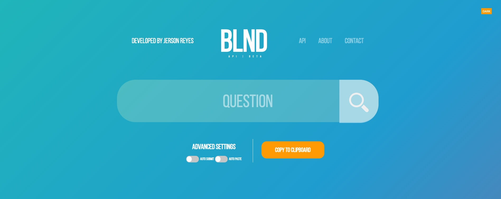
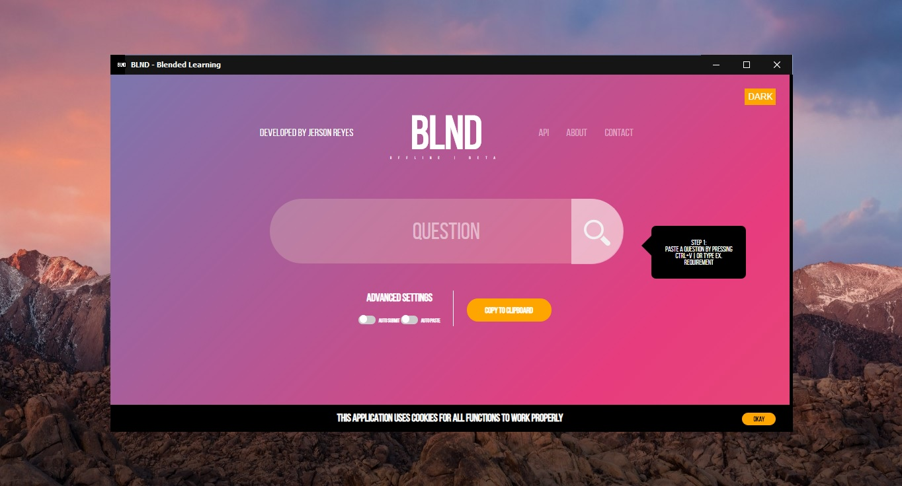

BLND - Discontinued
=====

    
   

## Description

Discover a new way — BLND is an automated answering system developed for AMA Blended Learning users  which can be accessed anywhere,   
anytime, and on any device. There are 21 subjects included. Instructions are also included at first visit. Everything is pre-designed. You only need to setup the website, upload the files, and you're all good! I decided to take down the site as I am not into programming anymore. At the very least, it gave me experience in which I am very happy.

    EARLY ACCESS:
    https://www.blnd.ga 
    (Original URL)

## Final Update - 1.2

BLND executable version released. Application can be accessed offline.
No installations required. Download the zip file from the bottom page link.

  
	
**Windows 10**

## Deployment
If you are not capable of spending money on hosting and buying your own domain, you can use free domain domain providers like freenom. (http://freenom.com/) and then use web hosting services such as x10hosting (https://x10hosting.com/)

All you have to do is setup a database, copy the phpmyadmin username and password, database name are also pre-set. Copy all of these information and change the values on the .php files.

**STEP BY STEP**

 1. Buy or get a free domain name (x10hosting)
 2. Use free web hosting services (freenom)
 3. Setup phpMyAdmin. Customize username, password and database name if possible. 
 4. Download the repo. Click Code > Download ZIP or clone using CLI Git.
4. Change $servername, $username, $password on handler/index.php blndd.api/index.php
5. Upload your files on your chosen web hosting.
6. Import `DATABASE (PRE-DESIGNED, IMPORT).sql` on your phpMyAdmin page.  You can also use the csv answer file if you choose to go with your own  database structure. Located at `answers/_COMBINED.csv`
7. Double check if you changed all server details on the handler file. A simple error can mess up your website.
8. Congrats! You've done it.

## Purpose
I made the website to share a fair play on AMA students. I know that there are unprivileged people out there who is battling with financial problems, those who have no access to any computers, or if by a chance, even if they do, they have no technical knowledge in doing so. On the other side, there are even those AMA campus computers that can't even run Microsoft Word. Because of that, I spent time making and designing the whole system so, make the most out of it. — It is not AMA server's fault that it keeps crashing at days of deadline. We also encountered this before. This was caused by cramming issues of students I myself included. So answer your exams, quizzes, periodical exams in an advance to prevent all of this from happening. 

## Download
Clone or download the whole repository. Click the Code button on top > Download ZIP or use CLI Git.

**Download directly**
	
	CLONE REPOSITORY:
    https://github.com/jersonreyes/blnd/archive/master.zip

**For students. Offline BLND Executable**
	
    https://github.com/jersonreyes/blnd/releases/download/1.2/BLND.Portable.zip

No prerequisites or set-up required. Google Chrome may flag the file as harmful. This is a false-positive. Choose keep on the download arrow. You can scan the file on *virustotal.com*.

## Important Note
 **Do not use for profit.** **I highly discourage use of ads.** Not all
 students have high data bandwidth or allocation. Develop this thinking that it will help a lot of people. Not only yourself. Good luck!
